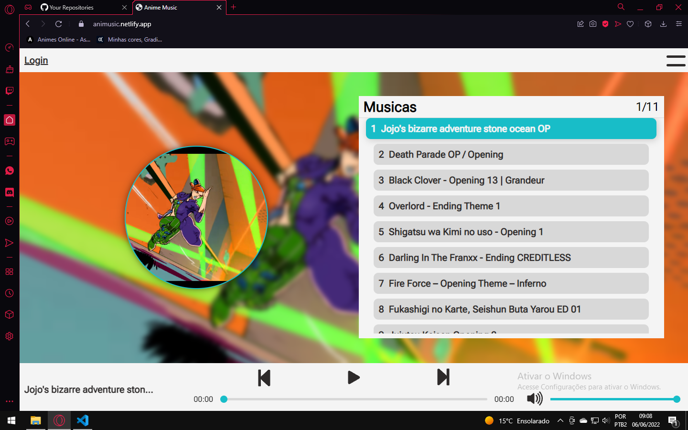

# ANIME MUSIC
## Quer conhecer o site?
<a href="https://animusic.netlify.app">Clique aqui</a> para ver o site funcionando em tempo real.

---
## Preview


## O que é ?
Um player de músicas de anime, que foi feito utilizando React, Typescript e Firebase.
Ele possui um sistema de autenticação, que é usado para restringir a adição de músicas apenas para as pessoas que tenham uma permissão.

---
## Posso clonar o projeto?
Sim, e para clonar é bem simples.<br/>

1. `git clone https://github.com/mayron1806/anime-music.git` para clonar o repositório.
2. `npm install` ou `yarn` para instalar as dependências.
3. Se não possui crie uma conta no <a href="https://firebase.google.com/" target="_blank">Firebase</a> e depois crie um novo projeto. (Caso tenha dúvidas é so <a href="https://medium.com/@adsonrocha/como-criar-um-projeto-no-firebase-273b984ea1b3#:~:text=Acesse%20o%20site%20do%20Firebase,console)e%20poderá%20criar%20projetos" target="_blank">clicar aqui</a> e você sera redirecionado para um artigo que explica como criar a conta de forma simples).
4. Após criar um projeto clique na engrenagem ao lado de "visão geral do projeto" e depois em "configurações do projeto".
5. Na aba geral desca a pagina ate encontrar a sessão "seus aplicativos".
6. Em "configuração de SDK" escolha a opção "configuração", abaixo deve ter algo parecido com isso. 
```javascript
const firebaseConfig = {
    apiKey: "xxxxxxxxxxxxxxxxxxxxxxxxxxxxxxxxxxxxxxx",
    authDomain: "xxxxxxxxxxxxxxxxxx.firebaseapp.com",
    databaseURL: "https://xxxxxxxxxxxxxxxxxxxxxxxxxxxxxxx.firebaseio.com",
    projectId: "xxxxxxxxxxxxxxxxxxx",
    storageBucket: "xxxxxxxxxxxxxxxxx.appspot.com",
    messagingSenderId: "000000000000",
    appId: "000000000000000000000000000000000000000"
};
``` 
Essas são basicamente as configurações do seu projeto que irão fazer a conexão dele com o firebase (não compartilhe esses dados com ninguem).<br/>
7. Abra o projeto que voce clonou no seu computador, dentro dele você deve encontrar um arquivo ".env.example" renomeie ele para ".env" e coloque os dados do firebase em cada uma das variaveis presentes nele.
O arquivo .env deve ficar mais ou menos assim: 
```
API_KEY="xxxxxxxxxxxxxxxxxxxxxxxxxxxxxxxxxxxxxxx"
AUTH_DOMAIN="xxxxxxxxxxxxxxxxxx.firebaseapp.com"
PROJECT_ID="xxxxxxxxxxxxxxxxxxx"
STORAGE_BUCKET="xxxxxxxxxxxxxxxxx.appspot.com"
MESSAGING_SENDER_ID="000000000000"
APP_ID="000000000000000000000000000000000000000"
```
8. Execute o comando `npm start` ou `yarn start`.
9. Acesse http://localhost:3000 no navegador.
---
## Como adicionar músicas?
O projeto possui um sistema para restringir a adição de música apenas para usuários ADMs. Infelizmente ainda não foi criado um sistema para solicitar ser ADM, então essa modificação e feita diretamente no banco de dados do firebase.
Mas se você esta clonando o repositório você não precisa dessa restrição, então para permitir a adição de músicas acesse o arquivo src/components/FormAddMusic/index.tsx.
Nele você deve encontrar uma funcão chamada "submitForm" substitua ela pela função abaixo.
```typescript
const submitForm = (e: FormEvent) => {
    e.preventDefault();
    const addMusic = async()=>{
        setResetForm(false);
        setUploadingMusic(true);
        const res = await Music.sendMusic(musicFiles.audioFile, musicFiles.imageFile, musicName)
        setStatusMessage(res);
        setUploadingMusic(false);
        // quando true os elemtos do formulario irao resetar
        setResetForm(true);
        setImageFile(undefined);
        setAudioFile(undefined);
    }
    addMusic();
}
```
Com essa substituição você deve conseguir adicionar músicas sem problemas.
